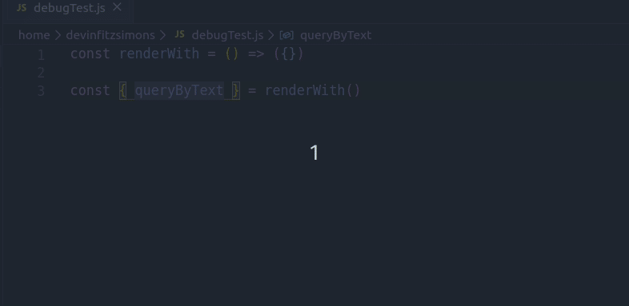

# React Testing Library - Quick Debug

This extension declares a debug and calls it on the next line for you. 



## Installing

This extension is available for free in the [Visual Studio Code Marketplace](https://marketplace.visualstudio.com/items?itemName=fitzsimonsdevin.rtl-quick-debug)

## How to use

#### Only activates with .js and .ts files

* Inside where you are declaring rtl queries, press `Cmd+Shift+B` (Mac), or `Ctrl+Shift+B` (Windows)
* The output will be a comma and a debug, and (on a new line) a debug that's called. `debug();`

#### Keyboard Shortcut
By default the keyboard shortcut is `Cmd+Shift+B` or `Ctrl+Shift+B`
If this shortcut interferes with another extension or system wide Shortcut, you may change it in the `Keyboard Shortcuts Setting`.

Press `Cmd+P` or `Ctrl+P` and type in `Open Keyboard Shortcuts`.
Search for `Log Javascript Selection` and click on the `pen icon`.
This is where you can enter any `Shortcut` you choose.

## Extras

There's a helpful pattern for testing where you can setup each test component with default props, then update the props as you go. This looks something like:
```js
describe('<Example />', () => {

  const setup = overrides => {
    const props = {
      title: "some title",
      ...overrides
    }

    const R = render(<Example {...props} />)

    return {
      ...R,
      props
    }
  }

  it('renders the provided title', () => {
      const { getByText } = setup('Override title!')

      expect(getByText('Override title!')).toBeInTheDocument()
  })
```

Since I use this all the time, I've added the keyboard shortcuts for the setup function and props. They are:

```
Cmd+Shift+J or Ctrl+Shift+J // destructures and logs props just like debug
Cmd+Shift+H or Ctrl+Shift+H // create a setup function stub
```


## Release Notes

### 1.1.2

Fix leading slash

### 1.1.1

When you use the `setup` function you now get the file name of your current file as the component name.

### 1.1.0

Add props logging and setup function generation

### 1.0.0

Initial release of React Testing Library - Quick Debug

### Developing this extension

Open the extension in vscode, hit `f5`. This should open a seperate editor that is the compiled version of your code!
In the new instace you can use the extension. In the debug console of the extension code instance you can see the debugger.

## License
[MIT License](LICENSE)